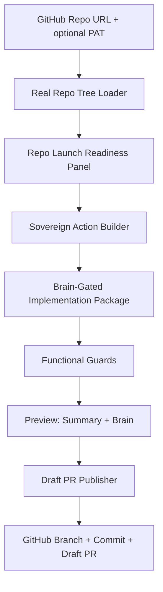

# 🌌 Sovereign Studio V3: The Autonomous Repository Architect

[](https://vitejs.dev/)
[](https://capacitorjs.com/)
[](https://github.com/features/actions)
[](docs/SOVEREIGN_READER.md)

## 📖 Practical Reader

Start here for the current functional structure, tools, skills, guardrails and best practices:

- [`docs/SOVEREIGN_READER.md`](docs/SOVEREIGN_READER.md) — practical map of repo loading, readiness scoring, brain-gated packages, functional guards, draft PR publishing, tests and anti-patterns.

---

## 🏛 Architectural Manifesto

Sovereign Studio V3 is a repository workbench for turning loaded GitHub repository snapshots into visible, guarded implementation packages and draft pull requests. It is built around one strict principle: autonomous-feeling workflows must still pass through visible preview, functional guards and deliberate user action before GitHub writes happen.

---

## 🏗 Current Functional Chain



---

## 🧩 Core Modules & Responsibilities

### 1. GitHub ingestion

- [`src/features/github/hooks/useGithubRepo.ts`](src/features/github/hooks/useGithubRepo.ts): loads real GitHub tree entries, supports default branch fallback and optional PAT use for private repositories.
- [`src/features/github/utils.ts`](src/features/github/utils.ts): parses and normalizes GitHub repository URLs.
- [`src/features/github/githubPackagePublisher.ts`](src/features/github/githubPackagePublisher.ts): validates generated files, creates a branch/tree/commit and opens a draft PR.

### 2. Readiness and reader layer

- [`src/features/product/runtime/repoLaunchReadiness.ts`](src/features/product/runtime/repoLaunchReadiness.ts): launch readiness score, grade, risk register, owner checklist and launch package markdown.
- [`src/features/product/runtime/repoLaunchReadinessFromFiles.ts`](src/features/product/runtime/repoLaunchReadinessFromFiles.ts): converts loaded repo paths into readiness signals.
- [`docs/SOVEREIGN_READER.md`](docs/SOVEREIGN_READER.md): practical operating guide for tools, skills and best practices.

### 3. Sovereign package runtime

- [`src/features/product/runtime/sovereignRuntime.ts`](src/features/product/runtime/sovereignRuntime.ts): creates brain-gated implementation packages.
- [`src/features/product/runtime/sovereignPackageFromRepoFiles.ts`](src/features/product/runtime/sovereignPackageFromRepoFiles.ts): builds packages from loaded repo snapshots.
- [`src/features/product/runtime/sovereignFunctionalGuards.ts`](src/features/product/runtime/sovereignFunctionalGuards.ts): blocks empty snapshots, duplicate generated paths, forbidden paths and incomplete docs packages.
- [`src/features/product/brain/sovereignBrainContract.ts`](src/features/product/brain/sovereignBrainContract.ts): defines the five-layer Sovereign brain contract.

### 4. Application shell

- [`src/App.tsx`](src/App.tsx): wires repo loading, readiness panel, action builder, brain preview and draft PR publishing.
- [`src/features/product/components/RepoReadinessPanel.tsx`](src/features/product/components/RepoReadinessPanel.tsx): visible score, rail, risk register, owner checklist and launch markdown.

---

## ⚙️ Guarded Workflow

1. Load a real GitHub repository tree.
2. Convert repo paths into readiness signals.
3. Show readiness score, risks and owner checklist.
4. Build a Sovereign package from mission + repo snapshot.
5. Enforce functional guards.
6. Show summary and brain preview.
7. Publish only as a draft PR and only after explicit user action.

No default-branch writes from the UI. No generated file can bypass guards before publishing.

---

## 🛠 Tech Stack Specification

| Component | Technology |
| :--- | :--- |
| **Frontend** | React, TypeScript, Vite |
| **Mobile Bridge** | Capacitor Android |
| **Repo Access** | GitHub REST API |
| **Runtime Guardrails** | TypeScript runtime checks |
| **Testing** | Vitest |
| **Publishing** | Draft PR branch/tree/commit flow |

---

## 🚀 Getting Started

```bash
npm install
npm run dev
```

Recommended verification before merging larger changes:

```bash
npm run type-check
npm run lint
npm run test:run
npm run build:web
```

---

## 🧪 Structure Tests

Important guard tests:

- `src/features/github/utils.test.ts`
- `src/features/github/githubPackagePublisher.test.ts`
- `src/features/product/runtime/repoLaunchReadiness.test.ts`
- `src/features/product/runtime/repoLaunchReadinessFromFiles.test.ts`
- `src/features/product/runtime/sovereignFunctionalGuards.test.ts`
- `src/features/product/runtime/sovereignPackageFromRepoFiles.test.ts`
- `src/features/product/runtime/sovereignStructure.test.ts`

---

## 📜 Metadata & Versioning

- **Project Name:** Sovereign Studio
- **Version:** 3.0.0
- **Current Focus:** guarded repo analysis, brain-gated package generation and draft PR publishing

---

This README is the short entry point. The practical operating manual lives in [`docs/SOVEREIGN_READER.md`](docs/SOVEREIGN_READER.md).
