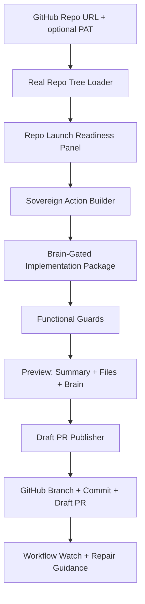

# 🌌 Sovereign Studio V3: The ProductionSecretWorking2024

[](https://vitejs.dev/)
[](https://capacitorjs.com/)
[](https://github.com/features/actions)
[](docs/SOVEREIGN_READER.md)

Sovereign Studio is a browser and Android workbench for loading a real GitHub repository snapshot, turning a concrete mission into guarded file changes, and publishing those changes only through a reviewable Draft Pull Request.

The project goal is simple: make repository automation feel fast without letting fake state, preview-only output, unsafe provider text or hidden workflow failures become the source of truth.

## Start here

- [`docs/SOVEREIGN_READER.md`](docs/SOVEREIGN_READER.md) — practical map of repo loading, readiness scoring, brain-gated packages, functional guards, draft PR publishing, tests and anti-patterns.
- [`docs/SOVEREIGN_RUNTIME.md`](docs/SOVEREIGN_RUNTIME.md) — runtime truth path, provider guardrails, workflow gates and validation chain.
- [`docs/LAUNCH_READINESS.md`](docs/LAUNCH_READINESS.md) — release checklist for a loaded repository and Play-Store-facing Android stability.
- [`docs/UPDATE_HISTORY.md`](docs/UPDATE_HISTORY.md) — human-readable release history.

## What the app does

1. Loads a real GitHub repository tree from a repository URL and optional PAT.
2. Converts the tree into readiness signals, risks and owner checklist items.
3. Builds an implementation package from the user mission and the loaded repo snapshot.
4. Requires the Sovereign brain contract before generated files are accepted.
5. Runs functional guards against forbidden paths, empty snapshots and incomplete packages.
6. Shows summary, generated files, diff context, telemetry and workflow state to the user.
7. Publishes only to a branch and Draft PR, never directly to `main` from the UI.
8. Watches GitHub checks and routes failures back to workflow/repair views.

## Runtime truth rules

- No mock snapshots in the live truth path.
- No DOM scraping as the source of runtime state.
- No direct default-branch writes from the app shell.
- No provider output is trusted until it passes the brain contract and file guards.
- UI/Coach state is derived from runtime state, workflow state, repo readiness and package state.
- Side-channel telemetry is useful for debugging, but it must not replace real runtime signals.

## Current functional chain



## Core modules

### GitHub ingestion

- [`src/features/github/hooks/useGithubRepo.ts`](src/features/github/hooks/useGithubRepo.ts): loads real GitHub tree entries and supports default-branch fallback.
- [`src/features/github/utils.ts`](src/features/github/utils.ts): parses and normalizes GitHub repository URLs.
- [`src/features/github/githubPackagePublisher.ts`](src/features/github/githubPackagePublisher.ts): creates branch/tree/commit and opens a Draft PR after file review.

### Product runtime

- [`src/features/product/runtime/sovereignPackageFromRepoFiles.ts`](src/features/product/runtime/sovereignPackageFromRepoFiles.ts): creates packages from loaded repo files.
- [`src/features/product/runtime/sovereignFunctionalGuards.ts`](src/features/product/runtime/sovereignFunctionalGuards.ts): blocks unsafe generated output before publishing.
- [`src/features/product/runtime/repoLaunchReadiness.ts`](src/features/product/runtime/repoLaunchReadiness.ts): builds readiness score, risk register and launch checklist.
- [`src/features/product/brain/sovereignBrainContract.ts`](src/features/product/brain/sovereignBrainContract.ts): defines the required perception, analysis, plan, execution and learning layers.

### App shell

- [`src/App.tsx`](src/App.tsx): wires repo loading, package building, diff loading, workflow watch, telemetry, automation gates and Draft PR publishing.
- [`src/features/product/components/RepoReadinessPanel.tsx`](src/features/product/components/RepoReadinessPanel.tsx): shows readiness score, risk register, checklist and launch markdown.

## Tech stack

| Area | Technology |
| :--- | :--- |
| Frontend | React, TypeScript, Vite |
| Mobile bridge | Capacitor Android |
| Repo access | GitHub REST API |
| Runtime validation | TypeScript runtime guards |
| Testing | Vitest |
| Release flow | GitHub Actions + Draft PR workflow |

## Local development

```bash
pnpm install
pnpm run dev
```

Recommended verification before merging:

```bash
pnpm run type-check
pnpm run test:unit
pnpm run build:web
pnpm run audit:sovereign
```

Android debug verification:

```bash
pnpm run build
cd android
./gradlew assembleDebug
```

## Release gates

A change is not release-ready only because a generated package exists. Treat it as a release candidate only after these gates are green on the relevant commit:

- TypeScript type check
- Unit tests
- Web build
- Runtime/UX/live-path contract scan
- Security/static audit
- Android debug APK build
- Real Android smoke test for startup, repo load, token masking, navigation, rotation and Draft PR gates

## Metadata

- **Project Name:** Sovereign Studio
- **Version:** 3.0.0
- **Current Focus:** guarded repo analysis, runtime-truth UI, brain-gated package generation and Draft PR publishing
