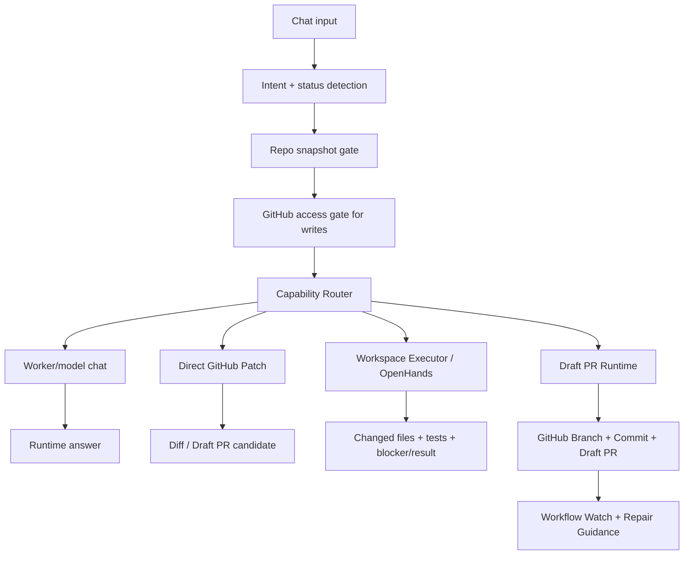

# 🐣 Sovereign Studio ATO: Chat-first Runtime Workbench

[](https://vitejs.dev/)
[](https://capacitorjs.com/)
[](https://github.com/features/actions)
[](docs/SOVEREIGN_PRODUCT_TRUTH.md)

Sovereign Studio ATO is an Android-first NoCode/AI service tool for working on real GitHub repositories through a calm chat surface.

A beginner should be able to enter a repository, describe a task, provide secure GitHub access when needed, and let Sovereign route the work through real runtime steps. The maximum automated write outcome is a reviewable Draft PR. The app must never auto-merge.

## Product truth

The core rule is non-negotiable:

```text
Do not build a UI that creates truth.
Build a runtime that creates truth.
The UI may only display that truth.
```

That means:

- Chat is the default surface.
- The user talks to Sovereign; Sovereign operates the control room behind the curtain.
- Repo, Files, Diff, Workflow, Runtime, Telemetry, Health, Coverage, Memory and Inspector are inspection surfaces, not the default room.
- No fake success, no hard percent progress, no mock/stub/facade in live paths.
- Every action produces a result; every result produces state; every state allows or blocks the next action.

## Start here

- [`docs/SOVEREIGN_PRODUCT_TRUTH.md`](docs/SOVEREIGN_PRODUCT_TRUTH.md) — the product invariants that prevent dashboard drift and fake runtime truth.
- [`docs/SOVEREIGN_RUNTIME.md`](docs/SOVEREIGN_RUNTIME.md) — the runtime truth path, GitHub access gates, worker/model routes, action stream and blocker rules.
- [`docs/SOVEREIGN_CAPABILITY_ROUTING.md`](docs/SOVEREIGN_CAPABILITY_ROUTING.md) — the current route architecture for chat, Direct GitHub Patch, workspace executors, OpenHands and Draft PRs.
- [`docs/GITHUB_AUTH_SESSION.md`](docs/GITHUB_AUTH_SESSION.md) — token handling, GitHub API validation, masking and Android clipboard guidance.
- [`docs/SOVEREIGN_READER.md`](docs/SOVEREIGN_READER.md) — practical map for future agents working in this repository.
- [`docs/UPDATE_HISTORY.md`](docs/UPDATE_HISTORY.md) — human-readable release and architecture history.

## Current live path

```text
src/App.tsx
→ src/features/product/containers/BuilderContainer.tsx
→ src/features/product/runtime/**
```

`BuilderContainer.tsx` is the central visible work surface. It should display runtime state and call runtime functions, not become the place where product truth is invented.

Runtime decisions belong under:

```text
src/features/product/runtime/**
```

## What the app currently does

1. Loads a real GitHub repository tree from chat or repo setup.
2. Keeps the repo snapshot in runtime state, not in the input field.
3. Detects normal chat, status questions, write intents and executor intents.
4. Routes normal questions through the worker/model path.
5. Blocks write intents until a repo is loaded and GitHub write access is API-validated.
6. Keeps GitHub access separate from executor availability.
7. Shows route decisions through the inline Sovereign Action Stream.
8. Creates branch/commit/Draft PR only through guarded write paths.
9. Watches workflow state after a produced commit and routes failures into repair guidance.

## Capability model

Sovereign should feel like one assistant to the user, but internally it must route by capability:

| User intent | Correct route | Notes |
| --- | --- | --- |
| Explain, summarize, advise | Worker/model route | No workspace or GitHub write required. |
| Ask “are you done?” or “why?” after a blocker | Local runtime answer | Must not blindly call the broken worker again. |
| Small README/docs change | Direct GitHub Patch route | Requires repo + validated GitHub write access. OpenHands must not be required. |
| Multi-file code work, tests, build repair | Workspace executor or OpenHands | Requires isolated workspace capability. |
| Draft PR | Draft PR runtime | Requires validated GitHub access and reviewed changes. |

OpenHands is not a normal LLM route. It is an optional workspace/code executor that may use an LLM. It can read files, operate in a sandbox and run commands. It should be one executor behind Sovereign, not the only way to change files.

## Current functional chain



## Core modules

### Visible product surface

- [`src/App.tsx`](src/App.tsx): app shell and tab orchestration.
- [`src/features/product/containers/BuilderContainer.tsx`](src/features/product/containers/BuilderContainer.tsx): central chat workbench and runtime-state display.
- [`src/features/product/components/SovereignActionStreamPanel.tsx`](src/features/product/components/SovereignActionStreamPanel.tsx): inline route/action trace.
- [`src/features/product/components/GitHubAccessCard.tsx`](src/features/product/components/GitHubAccessCard.tsx): secure GitHub access card.

### Runtime truth

- [`src/features/product/runtime/builderChatHelpers.ts`](src/features/product/runtime/builderChatHelpers.ts): chat-line and local status-answer helpers.
- [`src/features/product/runtime/githubAccessRuntime.ts`](src/features/product/runtime/githubAccessRuntime.ts): GitHub token format, API validation and access state.
- [`src/features/product/runtime/sovereignActionStreamRuntime.ts`](src/features/product/runtime/sovereignActionStreamRuntime.ts): route/action event stream.
- [`src/features/product/runtime/workerIntentDetector.ts`](src/features/product/runtime/workerIntentDetector.ts): intent split for worker/chat/code/executor cases.
- [`src/features/product/runtime/sovereignFunctionalGuards.ts`](src/features/product/runtime/sovereignFunctionalGuards.ts): guard layer before generated output can become publishable work.
- [`src/features/product/runtime/generatedFileReview.ts`](src/features/product/runtime/generatedFileReview.ts): generated file review before Draft PR creation.

### GitHub integration

- [`src/features/github/hooks/useGithubRepo.ts`](src/features/github/hooks/useGithubRepo.ts): loads real GitHub tree entries.
- [`src/features/github/githubAuthSession.ts`](src/features/github/githubAuthSession.ts): shared auth header and redaction helpers.
- [`src/features/github/githubPackagePublisher.ts`](src/features/github/githubPackagePublisher.ts): branch/tree/commit/Draft PR publisher.

## Documentation tasks that protect against drift

The active architecture is captured in open issues:

- `#500` — route write intents after GitHub ready without OpenHands lock-in.
- `#501` — Direct GitHub Patch route for README/docs changes.
- `#502` — Sovereign Capability Router.
- `#503` — agent-neutral isolated Workspace Runtime.
- `#504` — honest active blockers and deduped repeated route errors.
- `#505` — GitHub credential handling and Android clipboard guidance.

Future agents should implement these in order: blocker routing first, Direct Patch second, Capability Router third, Workspace Runtime after that.

## Local development

```bash
pnpm install
pnpm run dev
```

Recommended verification before merge:

```bash
pnpm run type-check
pnpm run test:unit
pnpm run build:web
pnpm run audit:sovereign
```

If available in the current repo state, also run:

```bash
pnpm run verify
pnpm run test:e2e
pnpm run audit:all
```

Android debug verification:

```bash
pnpm run build
cd android
./gradlew assembleDebug
```

## Release gates

A change is not release-ready because it looks good in chat or because a package exists. Treat it as a release candidate only after the relevant commit has real evidence for:

- TypeScript type check.
- Unit tests.
- Web build.
- Runtime/UX/live-path contract scan.
- Security/static audit.
- Android debug APK build.
- Real Android smoke test for startup, repo load, secure access, navigation, rotation and Draft PR gates.

If GitHub Actions or combined statuses are empty, say so. Do not claim CI green without visible evidence.

## Metadata

- **Project:** NOCODESTUDIO / Sovereign Studio ATO
- **Current focus:** chat-first runtime truth, GitHub access validation, capability routing, Direct GitHub Patch, isolated workspace executors and Draft PR safety.
